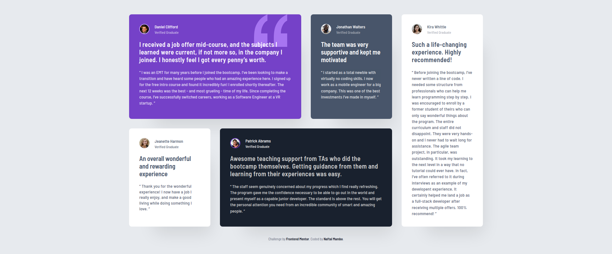
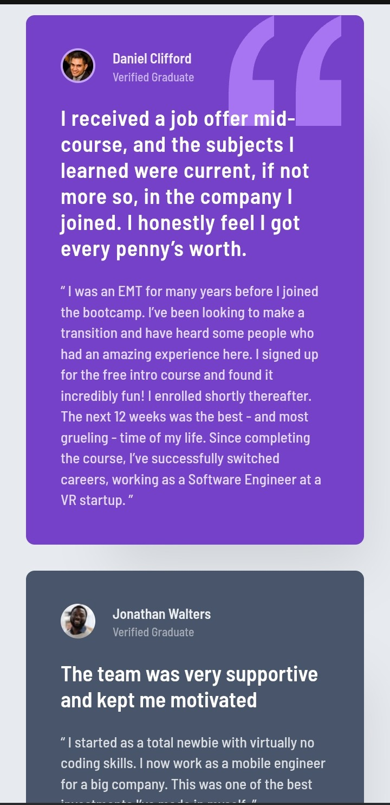
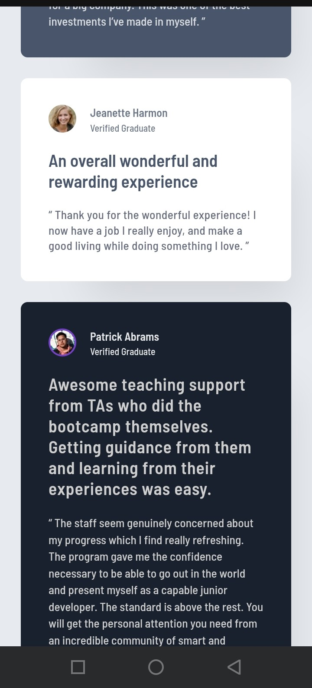
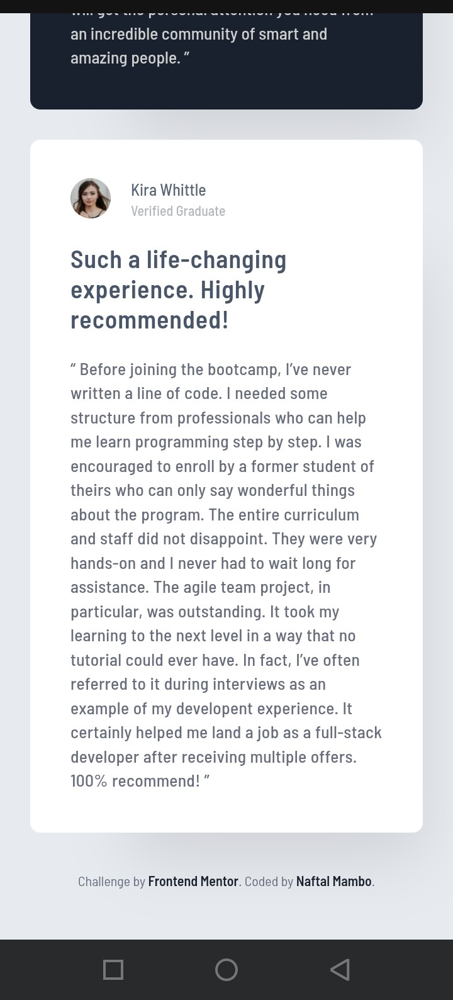

# Frontend Mentor - Testimonials grid section solution

### Design preview for the Testimonials grid section solution coding challenge

| Desktop Version                                  | Mobile Version                                 |
| :----------------------------------------------- | :--------------------------------------------- |
|  |  |

## Table of contents

- [Overview](#overview)
  - [The challenge](#the-challenge)
  - [Screenshot](#screenshot)
  - [Links](#links)
- [My process](#my-process)
  - [Built with](#built-with)
  - [What I learned](#what-i-learned)
  - [Continued development](#continued-development)
  - [AI Collaboration](#ai-collaboration)
- [Open for Opportunities & Collaboration](#open-for-opportunities--collaboration)
- [Acknowledgments](#acknowledgments)

## Overview

### The challenge

Users should be able to:

- View the optimal layout for the interface depending on their device's screen size
- See hover and focus states for all interactive elements on the page

### Screenshots

|              Desktop View              |              Mobile View 1              |              Mobile View 2              |              Mobile View 3              |
| :------------------------------------: | :-------------------------------------: | :-------------------------------------: | :-------------------------------------: |
|  |  |  |  |

### Links

- Solution URL: [GitHub Repository](https://github.com/naftalmambo/testimonials-grid-section)
- Live Site URL: [Live Demo](https://naftalmambo.github.io/testimonials-grid-section/)

## My process

### Built with

- **Semantic HTML5 markup**
- **CSS custom properties**
- **Grid**
- **Flexbox**
- **Mobile-first workflow**
- **Google Fonts (Barlow Semi Condensed)**
- **VS Code** - My primary editor for writing clean, structured code.
- **Linux (Ubuntu/WSL)** - My development environment for a professional, stable workflow.
- **Windows Browser (Chrome)** - Used for cross-browser testing to ensure its responsive.

### What I learned from this work

This project was a big step for me in learning how to make websites look professional. Here is what I practiced:

- **Naming things clearly**: Instead of using the same name for every card, I gave them unique names like `card-violet` and `card-white`. This made it easier to change colors and opacities without breaking other parts.
- **Faded Text Effects**: I learned that using `opacity` (like 0.5 or 0.7) on a dark color makes text look much better on white backgrounds than just picking a light grey color.
- **Pixel-Perfect Wrapping**: I learned to use `letter-spacing` and `word-spacing` to make the text on Kira's card wrap at exactly 16.5 lines, just like the design.
- **Asymmetrical Grid**: I learned how to use `grid-column: span 2` and `grid-row: span 2` to create a complex layout where cards have different sizes.

### Continued development

In future work, I intend to focus on:

- **Clean code:** In this project, I wrote separate styles for each card to make sure I didn't make any mistakes. I know that I can group similar styles (like padding, font, color and rounded corners) to make my code shorter, but I wasn't comfortable doing it yet. I am learning how to do it now and will try to use groupings in my future projects to make my code simple and easy to read.

- **Responsiveness:** I believe I've tried my best to make this project as responsive as possible through use of mobile-first approach, while also open to improvements.

### AI Collaboration.

- **Tools Used:** Google AI.

I used AI as a tutor to help me understand the "why" behind the code:

- **Explaining Logic**: Instead of just getting code, I asked the AI to explain how Flexbox and Grid work together.
- **Debugging**: When my design looked different on Windows than it did on Linux, the AI helped me find the problem with how browsers render fonts and display scaling.
- **Mastering Best Practices**: The AI taught me to use **REM** instead of pixels for better spacing and how to use **Semantic HTML** (like `blockquote` and `article`) to make my site better for everyone.

## Open for Opportunities & Collaboration

This project marks the beginning of my journey toward becoming a professional Web Developer and ultimately a Java Full-Stack. I am currently:

- 🔭 **Open for work:** Looking for junior roles or freelance opportunities where I can apply my skills in HTML, CSS, and Javascript(in-progress).
- 🤝 **Open to contribute:** Interested in collaborating on open-source projects or team-based challenges.

If you like what you see or have a project you need help with, connect with:

**Author**

- Frontend Mentor - [@naftalmambo](https://frontendmentor.io)
- LinkedIn - [Naftal Mambo](https://linkedin.com)
- GitHub - [@naftalmambo](https://github.com)
- Discord - [devMambo](https://discordapp.com/users/1157321092482994246)

## Acknowledgments

### 🌟 Appreciation for Frontend Mentor

I want to express my sincere gratitude to **[Frontend Mentor](https://www.frontendmentor.io)** for providing these incredible, real-world challenges that I am sure will enable me to grow to be the developer I aspire.

This platform will be more than just a place to practice, it will be a gateway to building skills that truly **change lives**.

By bridging the gap between theory and professional workflows, Frontend Mentor will help me build a rock-solid skill for a future where I can create meaningful digital solutions.

## Credits

While this is a [Frontend Mentor](https://www.frontendmentor.io) challenge, the structural and styling knowledge used to build it was gained through;

- **freeCodeCamp**: For the consistent interactive practice that solidified my HTML and CSS fundamentals.
- **The Odin Project**: For teaching me how to set up my local working environment and to think like a developer.
